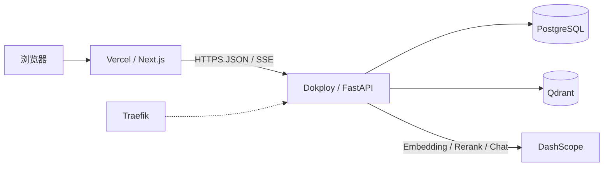
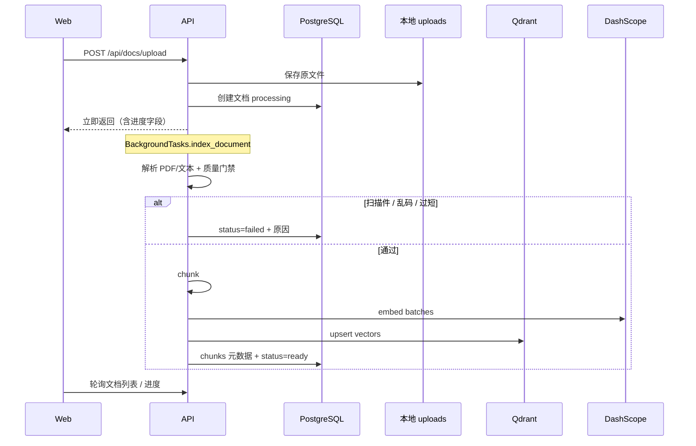
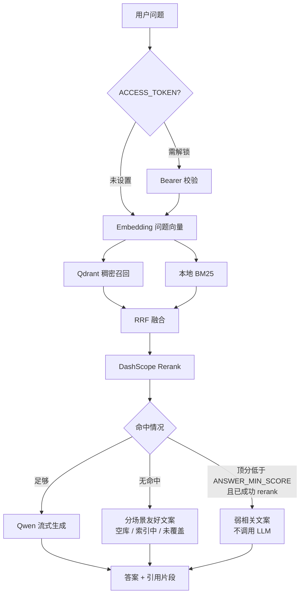

# DustyKB

把文档变成可追问的知识。面向个人 / 小团队的中文 RAG 文库：建文库 → 收录资料 → 对着原文提问并核对出处。

**技术栈：** Next.js 前端 · FastAPI 后端 · PostgreSQL · Qdrant · 通义 DashScope（Embedding / Rerank / Qwen）

> 自研检索与问答管线，**不依赖 LangChain / LangGraph**。需要复杂 Agent（多轮重试、答后校验）时可再演进，不必为了 RAG 先上框架。

## 目录结构

```
.
  docker-compose.yml           # 本地：Postgres + Qdrant + API + Web
  docker-compose.dokploy.yml   # Dokploy：API + Postgres + Qdrant（Traefik）
  .env.example
  apps/
    api/                       # FastAPI
    web/                       # Next.js（建议部署到 Vercel）
```

## 架构

### 部署拓扑

生产环境前后端分离：浏览器只打 Vercel 上的 Web；Web 通过 `NEXT_PUBLIC_API_URL` 调用 Dokploy 上的 API。API 与 Postgres、Qdrant 同 compose 内网互通，对外由 Traefik 终结 HTTPS。



本地 `docker compose` 可把 Web 一并拉起；生产推荐 Web 走 Vercel，Compose 只用 `docker-compose.dokploy.yml`（api + postgres + qdrant）。

### 入库流程（异步）

上传先落库并返回 `processing`，再在后台解析、质检、切块、向量化写入 Qdrant。



要点：

- PDF：优先 PyMuPDF，失败回退 pypdf；`assess_extract_quality` 拦截疑似扫描件与乱码（**暂无 OCR**）。
- 进度阶段大致：`queued` → 解析 / embedding → `ready` 或 `failed`。
- 原文件路径：`data/uploads/{kb_id}/…`（Docker 卷或本地 `apps/api/data`）。

### 问答流程



要点：

- 混合检索默认开启：`HYBRID_ENABLED` + `BM25_TOP_K` + `RRF_K`，再 `RETRIEVE_TOP_K` → `RERANK_TOP_K`。
- 流式接口：`POST /api/query/stream`（SSE：`sources` → `token*` → `done`）。
- 弱相关门槛仅在 **rerank 成功** 后生效，避免误伤纯 RRF 小分数；`ANSWER_MIN_SCORE=0` 可关闭。

### 核心模块（实现落点）

| 路径 | 职责 |
|------|------|
| `apps/api/app/main.py` | 路由、CORS、上传后台任务、SSE 问答 |
| `apps/api/app/services/rag.py` | 入库索引、检索编排、`no_match` / `weak_match` |
| `apps/api/app/services/documents.py` | 多格式解析、CJK 规范化、抽取质量门禁 |
| `apps/api/app/services/chunking.py` | 文本切块 |
| `apps/api/app/services/hybrid.py` | BM25 缓存与 RRF 融合 |
| `apps/api/app/services/qdrant_store.py` | 向量写入 / 检索 |
| `apps/api/app/services/chunk_store.py` | chunk 元数据（Postgres） |
| `apps/api/app/services/store.py` | 文库 / 文档元数据、上传路径 |
| `apps/api/app/services/llm.py` | Embedding / Chat / Rerank 客户端 |
| `apps/api/app/services/answer_copy.py` | 无命中、弱相关中文文案 |
| `apps/api/app/auth.py` | 共享口令与 `owner_id` |
| `apps/web/components/dashboard/*` | 问答台、文库、档案、看板与空状态引导 |
| `apps/web/lib/api.ts` | 前端 API 与流式消费 |

数据大致分工：**Postgres** 存文库/文档/chunk 元数据/问答日志；**Qdrant** 存向量；**磁盘** 存上传原件。

## 生产部署（推荐）

| 组件 | 部署位置 | 示例 |
|------|----------|------|
| Web | Vercel | `https://rag.webch.cn` |
| API + Postgres + Qdrant | Dokploy（腾讯云等） | `https://api.verogeo.com` |

### Vercel（前端）

1. 导入本仓库，Root Directory 指向仓库根（或含 `apps/web` 的 monorepo 配置按实际为准）。
2. 环境变量：

```bash
NEXT_PUBLIC_API_URL=https://api.verogeo.com
```

3. 自定义域名（如 `rag.webch.cn`）：在 Vercel Domains 添加后，DNS 配 A/`CNAME` 到 Vercel。

### Dokploy（后端）

1. Compose 源使用仓库根目录：`./docker-compose.dokploy.yml`。
2. Git 建议用 **SSH Deploy Key** 拉代码（国内机房 HTTPS 易 TLS 中断），分支 `main`。
3. 关键环境变量见下文；改 `CORS_ORIGINS` / `ACCESS_TOKEN` 后需重建/重启 API。

### 必配环境变量（生产）

```bash
# 模型（必填）
DASHSCOPE_API_KEY=sk-xxx
# 或 OPENAI_API_KEY=sk-xxx（OpenAI 兼容，与上者二选一，优先 OPENAI_API_KEY）

# 前端来源，逗号分隔（须含实际访问域名，注意拼写）
CORS_ORIGINS=https://rag.webch.cn,https://dusty-kb-three.vercel.app,http://localhost:3000

# 站点口令（推荐）。设置后前端显示解锁页，请求需 Bearer
ACCESS_TOKEN=your-long-random-secret

# 可选：rerank 顶分低于此值则不调用 LLM，返回友好「相关度不够」文案；0=关闭
ANSWER_MIN_SCORE=0.12
```

## 能力概览

| 模块 | 说明 |
|------|------|
| 文库 / 文档 | 创建文库、上传、异步索引、进度与失败原因、重新索引 |
| 解析 | PDF 优先 PyMuPDF，失败回退 pypdf；扫描件/乱码质量门禁（暂不支持 OCR） |
| 检索 | 稠密向量 + 本地 BM25 + RRF 融合，再 DashScope Rerank |
| 问答 | 流式回答、引用片段；无命中/弱相关有分场景友好文案 |
| 访问控制 | 共享 `ACCESS_TOKEN`；知识库带 `owner_id`（非多租户 Clerk） |
| 前端 | 问答台 / 文库 / 档案 / 看板；移动端抽屉与吸底输入 |

支持文件：`.txt` / `.md` / `.pdf` / `.csv` / `.tsv` / `.xlsx`

## 本地 Docker 一键启动

```bash
cp .env.example .env
# 填入 DASHSCOPE_API_KEY 或 OPENAI_API_KEY
docker compose up --build -d
```

- Web：[http://localhost:3000](http://localhost:3000)
- API 健康检查：[http://localhost:8000/health](http://localhost:8000/health)

### 数据持久化

| 数据 | 位置 |
|------|------|
| 上传文件 | 卷 `api_data` → `/app/data/uploads/{kb_id}/` |
| 元数据 | 卷 `postgres_data` |
| 向量 | 卷 `qdrant_data` |

本机查看上传文件：

```bash
cp docker-compose.override.example.yml docker-compose.override.yml
docker compose up -d
```

```bash
docker compose logs -f api
docker compose down          # 保留卷
docker compose down -v       # 清空卷（慎用）
```

## 本地开发

### 1. Postgres + Qdrant

```bash
docker compose up -d postgres qdrant
```

### 2. API

```bash
cd apps/api
cp ../../.env.example .env
# 填入 DASHSCOPE_API_KEY
uv sync --python /opt/homebrew/bin/python3.12
PYTHONPATH=. uv run --python /opt/homebrew/bin/python3.12 uvicorn app.main:app --reload --port 8000
```

若存在旧版 `knowledge_bases.json` / `documents.json`，启动时会迁移到 PostgreSQL。上传文件目录：`apps/api/data/uploads/`。

### 3. Web

```bash
cd apps/web
cp .env.local.example .env.local
# NEXT_PUBLIC_API_URL=http://localhost:8000
pnpm dev
```

打开 [http://localhost:3000](http://localhost:3000)。

## API 摘要

生产环境建议设置 `ACCESS_TOKEN`：请求头 `Authorization: Bearer <token>`。未设置则开放（适合本地）。

| 方法 | 路径 | 说明 |
|------|------|------|
| GET | `/health` | 健康检查 |
| GET | `/api/auth/status` | 是否要求访问令牌 |
| GET/POST | `/api/kb` | 文库列表 / 创建 |
| GET | `/api/kb/{id}/docs` | 文档列表 |
| GET | `/api/kb/{id}/query-logs` | 问答档案 |
| POST | `/api/docs/upload` | 上传入库（form: `kb_id`, `file`） |
| DELETE | `/api/docs/{id}` | 删除文档 |
| POST | `/api/docs/{id}/reindex` | 重新索引 |
| POST | `/api/query` | 同步问答 |
| POST | `/api/query/stream` | 流式问答（SSE） |

## 模型与检索默认值

| 项 | 默认 |
|----|------|
| Embedding | `text-embedding-v3`（1024 维） |
| Rerank | `qwen3-rerank`（召回 20 → 重排 6） |
| Chat | `qwen-plus` |
| 弱相关门槛 | `ANSWER_MIN_SCORE=0.12`（仅成功 rerank 后生效） |

Key 写在 `apps/api/.env` 的 `DASHSCOPE_API_KEY`（或 `OPENAI_API_KEY`）。完整变量见 `.env.example`。

## 测试

```bash
cd apps/api
uv sync --python /opt/homebrew/bin/python3.12 --group dev
PYTHONPATH=. uv run --python /opt/homebrew/bin/python3.12 pytest
```

## 路线图（简）

- 已做：异步入库、中文 PDF 质量门禁、混合检索、流式问答、站点口令、问答空状态与弱相关文案
- 可选下一步：无命中轻量改写再检索、答后校验；扫清 OCR；多用户（Clerk）——按真实需求再上
- 复杂 Agent 编排可评估 LangGraph；日常 RAG 不必引入 LangChain
